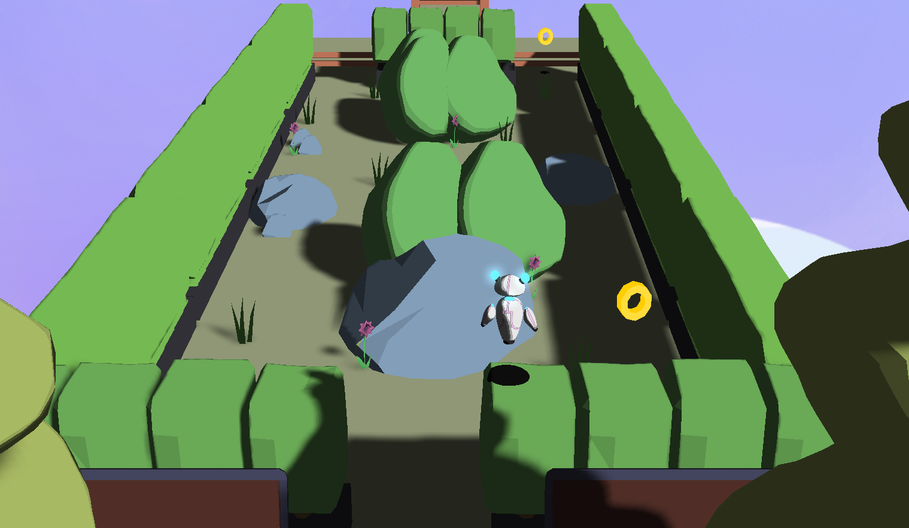
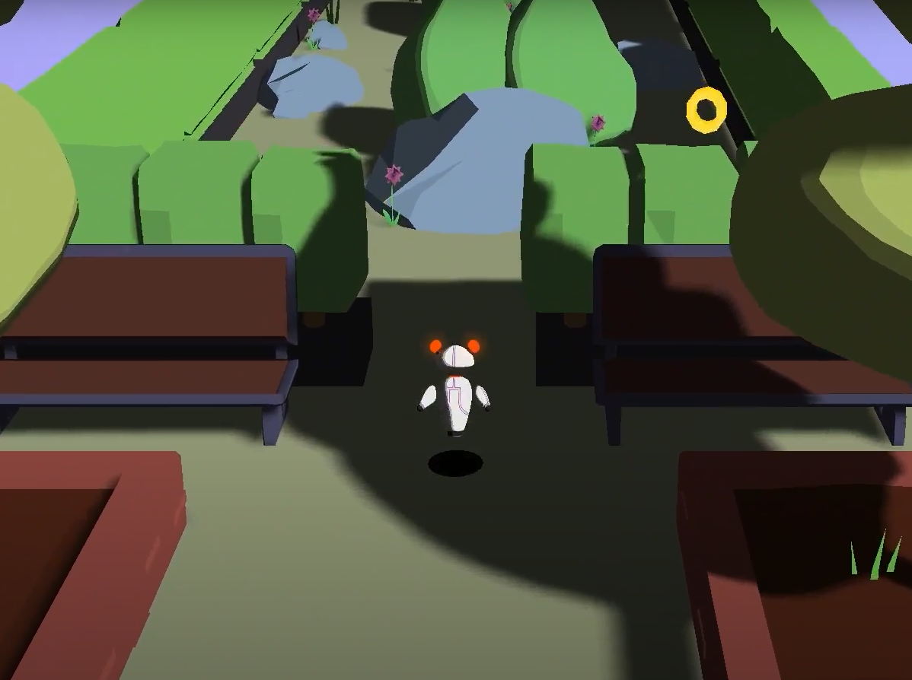
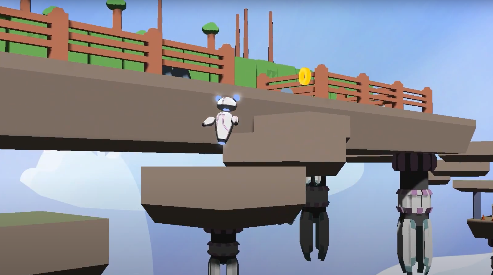
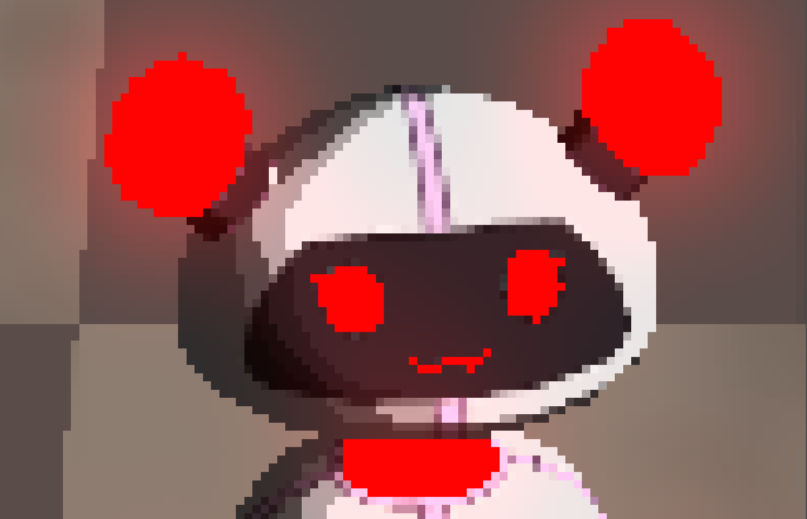

# joy:)

Joy is a 3D platformer about the robot Joy trying to impress her creator and wants show the world how smart he is.
The goal is to traverse a course as fast as possible while collecting bolts and managing your fuel.
The game is time based, where a shorter time results in a better score. Colleting bolts reduces your time, thus increasing your final score.

It was developed as a course at Blekinge Institute of Technology.

# Details
* DirectX 11
* AABB Collision
* Pickups (Bolts)
* Lightmaps
* Toon Shader
* Glow
* Decal

# . JOY
Joy uses its own binary fileformat for importing data.
A .FBX file is converted into a .JOY offline, which is loaded and interpreted at runtime.

It contains:
  * Meshdata
  * Materials
  * Cameras
  * Morph-Animation
  * Skeletal-Animation
  * Lights
  * Groups
  * Custom attributes from Maya

# Creators
* Björn Emilio Håkanssoon ([slowstone42](https://github.com/slowstone42))
* Oliver Klingspor ([Olowerr](https://github.com/Olowerr))
* Alexandra Lindberg ([alexandra-lindberg](https://github.com/alexandra-lindberg))
* Rasmus Lisander ([savie17](https://github.com/savie17))
* Adam Åkesson ([Simadra](https://github.com/Simadra))

# Images

